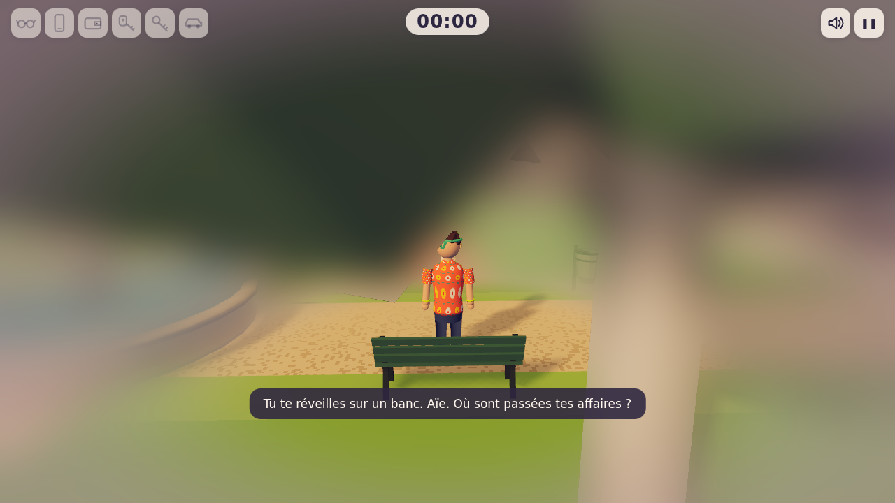
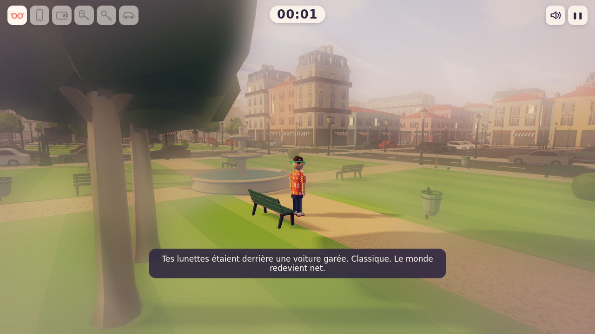

# Gueule de bois

Jeu 3D dans le navigateur, vue à la 3e personne. Tu te réveilles sur un banc public après une soirée trop arrosée. Tes lunettes, ton téléphone, ton portefeuille, tes clés… tout a disparu. Retrouve tes affaires éparpillées dans la ville, récupère ta voiture (celle avec un cône de chantier sur le toit) et rentre chez toi.

Un Paris stylisé au petit matin (immeubles haussmanniens, toits en zinc, colonnes Morris, bancs verts, platanes), humour léger, et tout est généré par le code : aucun asset externe.

**Démo :** https://undefinedfr.github.io/hangover/ (une fois GitHub Pages activé, voir [Déploiement](#déploiement))





## Contrôles

| Touche | Action |
|---|---|
| ZQSD / WASD (ou flèches) | Se déplacer (touches physiques : AZERTY et QWERTY marchent tout seuls) |
| Souris | Caméra (clic : capture du pointeur, Échap : libérer) |
| Shift | Courir |
| Espace | Sauter / frein à main en véhicule |
| E | Ramasser, monter ou descendre d'un véhicule, ouvrir |
| Tab | Inventaire |
| Échap | Pause |
| M | Couper / remettre le son |

Sur mobile : joystick virtuel à gauche, zone caméra à droite, boutons d'action.

## Objets et règles

| Objet | Effet |
|---|---|
| Lunettes | Supprime le flou |
| Téléphone | Mini-carte dans le HUD |
| Portefeuille | Requis pour conduire et pour gagner (« sans papiers, pas de volant ») |
| Clés de voiture | Ouvrent et démarrent la voiture |
| Clés de maison | Ouvrent la porte d'arrivée |
| Voiture | Garée quelque part en ville, verrouillée sans les clés |

**Victoire :** avoir les objets requis, arriver **en voiture** devant la maison (bleue, toit rouge, porte jaune), descendre et ouvrir la porte (E).

Une trottinette (2× la vitesse de marche) et un tricycle (un peu plus lent, pédalage et bruit de roulement, silencieux sur la moquette) sont aussi posés en ville.

## Modes

| | Facile (~5 min) | Normal (~15 min) | Hardcore (30 min et +) |
|---|---|---|---|
| Ville | 4×4 blocs | 7×7 blocs | 11×11 blocs |
| Objets | lunettes, clés de voiture, clés de maison, voiture | tous | tous |
| Halo | visible de loin | à moins de 15 m | aucun |
| Flou sans lunettes | léger | normal | fort, rayon net ~1,5 m |
| Titubement | faible | moyen | fort |
| Mini-carte | voiture + maison (téléphone déjà en poche) | voiture + maison, après le téléphone | aucune |
| Cachettes | au sol, en évidence | derrière des props | recoins, sous les bancs, dans les poubelles |

Un bouton **Graphismes : détaillés / légers** dans le menu adapte le rendu aux machines modestes (pas d'occlusion ambiante, résolution 1×, vue plus courte). On peut aussi forcer `?quality=low`.

Chaque partie a une **seed** (`?seed=1234&mode=normal` dans l'URL) pour rejouer exactement la même ville. Les meilleurs temps par mode sont gardés dans le navigateur.

## Technique

- [three.js](https://threejs.org) `WebGPURenderer` (repli automatique sur WebGL2) et **TSL** : fenêtres procédurales des immeubles, halos, flou « gueule de bois » en post-process (flou gaussien mélangé selon la distance au joueur, reconstruite depuis la profondeur).
- [Rapier](https://rapier.rs) : collisions, `KinematicCharacterController` pour le personnage et les véhicules.
- TypeScript strict + Vite. HUD et menus en HTML/CSS. Sons synthétisés en WebAudio.
- Ville, objets et véhicules générés procéduralement (RNG mulberry32 seedé), mobilier en `InstancedMesh`.

```
src/
  core/      Game, boucle à pas fixe 60 Hz, Input, GameState, RNG seedé, Physics
  world/     CityGenerator, props, maison d'arrivée, matériaux TSL, environnement
  player/    personnage + animation procédurale, caméra 3e personne
  vehicles/  Vehicle (base), Car, Scooter, Tricycle
  items/     modèles, Item, ItemSpawner, Inventory
  fx/        DrunkBlur (post-process TSL)
  ui/        HUD, mini-carte, menu, pause, écran de fin, contrôles tactiles
  audio/     AudioManager (WebAudio)
  debug/     hook de test window.__game
tests/       tests Playwright
```

## Commandes

```bash
npm install
npm run dev        # serveur de développement
npm run build      # build de production dans dist/
npm run preview    # sert le build
npm run test:e2e   # tests de fumée Playwright (sur le build)
npm run capture    # régénère public/og-image.png et docs/*.png (build servi sur :4173)
```

Les tests tournent dans Chromium headless en rendu logiciel (SwiftShader). Ils vérifient : chargement sans erreur, menu, rendu non vide, déplacement, saut, collisions avec les immeubles, ramassage de chaque objet, flou avant/après lunettes, véhicules, pause, mini-carte, écran navigateur non supporté et scénario complet jusqu'à la victoire.

Hook de test : `window.__game` expose `state`, `mode`, `seed`, `inventory`, `player.position`, `inVehicle`, `fps`, ainsi que `debug.startGame(mode, seed)` et `debug.teleportTo(nom)`.

## Déploiement

Le workflow `.github/workflows/deploy.yml` construit et publie `dist/` sur GitHub Pages à chaque push sur `main`. Il faut activer Pages une fois : **Settings → Pages → Source : GitHub Actions**, puis relancer le workflow (onglet Actions → « Déploiement GitHub Pages » → Run workflow).

Le build utilise `base: './'` et fonctionne depuis n'importe quel sous-chemin.
